# 
 Library 

### Vision

"Library" is a web application that allows users to record and view information about readers, books, book genres, and currently borrowed books.  

The application should provide:

* Storing borrowed books, readers, books, in a database;
* Displaying the list of currently borrowed books.
* Updating list of currently borrowed books (borrowing books, returning books);
* Displaying the list of readers;
* Updating the list of readers (adding, editing, removing);
* Displaying the list of books;
* Updating the list of books (adding, editing, removing);
* Displaying the list of genres;

## 1. Borrowed books

### 1.1 Display the list of borrowed books

The mode is designed to view the list of currently borrowed books. 

**Main scenario:**

* User select item "Borrowed";
* Application displays list of borrowed books.

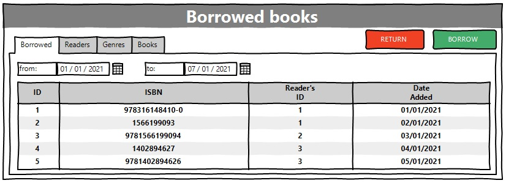
Pic. 1.1 View of the list of borrowed books.

The list displays following columns:

* ID of the operation;
* ISBN of the book;
* Readers ID;
* Date added.

### 1.2 Borrow book

**Main Scenario:**

* User clicks the "Borrow" button in the borrowed books view mode;
* Application displays the form to enter borrow book data;
* User enters borrow book data and presses "SAVE" button;
* If any data is entered incorrectly, incorrect data messages are displayed;
* If entered data is valid, then the record is added to databased;
* If an error occurs, then an error message is displayed;
* If the operation is successfull, the list of borrowed books with updated information displayed.

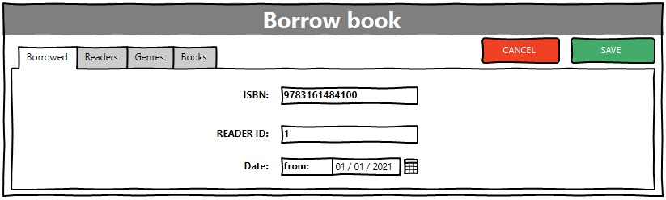
Pic 1.2 Borrow book.

**Cancel operation scenario:**

* User clicks the "Borrow" button in the borrowed books view mode;
* Application displays the form to enter borrow book data;
* User enters borrow book data and presses "CANCEL" button;
* Data doesn't save in database, the list of borrowed books is displayed to the user;
* If the user selects tabs "Borrowed", "Readers", "Genres", or "Books", the data will not be saved in the database, and the corresponding form will be opened. 

### 1.3 Return book

**Main Scenario:**

* The user, while in the list of borrowed books, presses the "Return" button;
* Application displays the form to enter return book data;
* User enters return operation data and press "SAVE" button;
* If entered data is valid, the borrow operation is removed from database;
* If an error occurs, then an error message is displayed;
* If the return operation is successfully completed, the list of borrowed books with updated information is displayed.

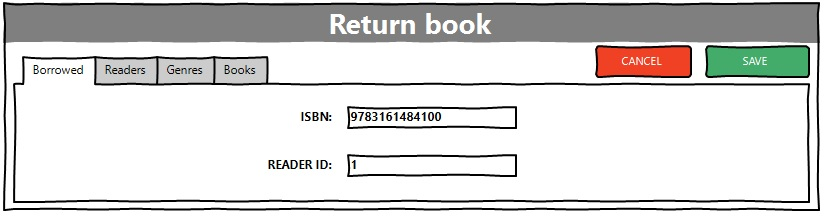
Pic. 1.3 Return book.

**Cacel operation scenario:**

* The user, while in the list of borrowed books, presses the "Return" button;
* Application displays the form to enter return book data;
* User enters return operation data and press "CANCEL" button;
* List of borrowed books without changes is displayed.
* If the user selects tabs "Borrowed", "Readers", "Genres", or "Books", the data will not be saved in the database, and the corresponding form will be opened. 

## 2. Readers

### 2.1 Display the list of Readers

This mode is intended for viewing and editing the readers list.

**Main Scenario:**

* User selects item "Readers";
* Application displays list of readers.

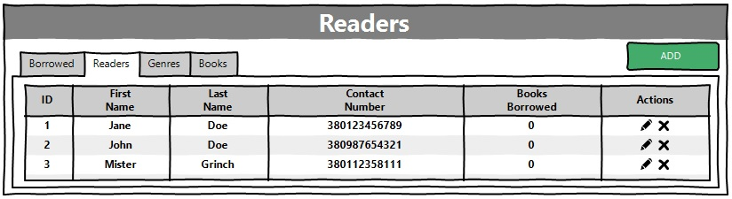
Pic 2.1 View of readers list.

The list displays the following columns:

* ID - reader's id number;
* First name - reader's first name;
* Last name - reader's last name;
* Contact number - reader's contact number;
* Books borrowed - numbers of currently borrowed books by user.

### 2.2 Add reader

**Main Scenario:**

* User clicks the "Add" button in the readers list view mode;
* Application displays form to enter reader's data;
* User enters reader's data and press "SAVE" button;
* If any data is entered incorrectly, incorrect data message is displayed;
* If entered data is valid, the record is added to the database;
* If error occurrs, then error message is displayed;
* If new reader record is successfully added, then up to date list of readers is displayed.

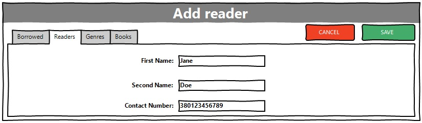
Pic. 2.2 Add reader.

**Cacel operation scenario:**
* User clicks the "Add" button in the readers list view mode;
* Application displays form to enter reader's data;
* User enters reader's data and press "CANCEL" button;
* Data doesn't save in database, list of readers without changes is displayed to user. 
* If the user selects tabs "Borrowed", "Readers", "Genres", or "Books", the data will not be saved in the database, and the corresponding form will be opened.  

When adding a reader, the following details are entered:
* First name - reader's first name;
* Last name - reader's last name;
* Contact number - reader's contact number;

Constraints for data validation:

* First name - maximum length of 45 characters;
* Last name - maximum length of 45 characters;
* Contact number - maximum length of 12 characters.

### 2.3 Edit reader
**Main Scenario:**

* User clicks the "Edit" button in the reader's list view mode;
* Application displays form to enter reader's data;
* User enters reader's data and presses "SAVE" button;
* If any data is entered incorrectly, incorrect data message is displayed;
* If entered data is valid, the record is edited in the database;
* If error occurrs, then error message is displayed;
* If new reader record is successfully edited, then up to date list of readers is displayed.

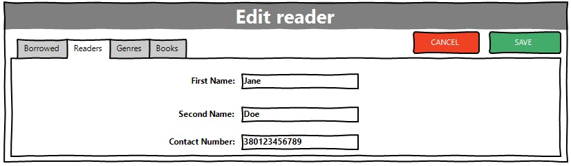
Pic. 2.3 Edit reader.

**Cacel operation scenario:**
* User clicks the "Edit" button in the reader's list view mode;
* Application displays form to enter reader's data;
* User enters reader's data and presses "CANCEL" button;
* Data doesn't save to dabase, list of readers without changes is displayed to user. 
* If the user selects tabs "Borrowed", "Readers", "Genres", or "Books", the data will not be saved in the database, and the corresponding form will be opened.  

### 2.4 Delete reader

**Main Scenario:**
* User clicks the "Delete" button in the readers list view mode;
* Application displays confirmation dialog “Are you sure you want to delete reader?”;
* The user confirms the deletion of the reader;
* Record is deleted from the database;
* If error occurs, then error message is displayed;
* If the reader record is successfully deleted, then up to date list of readers is displayed.

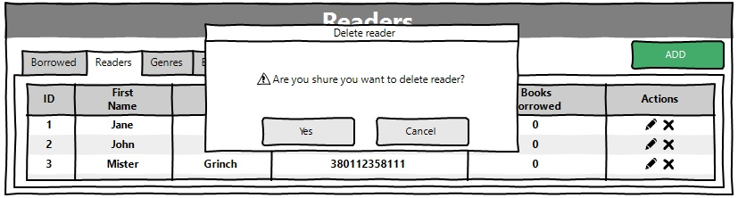
Pic. 2.4 Delete reader dialog. 

**Cacel operation scenario:**

* User clicks the "Delete" button in the reader's list view mode;
* Application displays confirmation dialog “Please confirm delete reader?”;
* The user cancel the deletion of the reader;
* List of readers without changes is displayed to user.
* If the user selects tabs "Borrowed", "Readers", "Genres", or "Books", the data will not be saved in the database, and the corresponding form will be opened.  

## 3. Genres

### 3.1 Display list of genres

This mode is intended for viewing genres list

**Main Scenario:**

* User selects item "Genres";
* Application displays list of genres.
* 
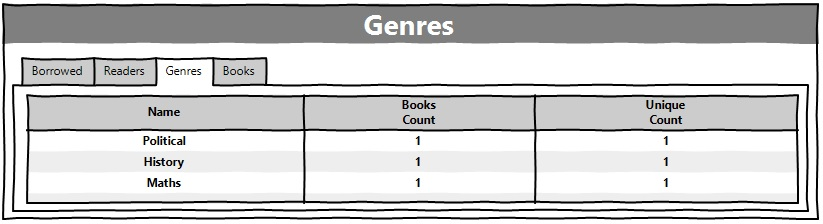
Pic. 3.1. View the genres list.

The list displays the following columns:

* Name - Name of the genre;
* Books count - total books count of a certain genre;
* Unique count - total unique books count of a certain genre.

## 4. Books

### 4.1 Display list of books

This mode is intended for viewing books list

**Main Scenario:**

* User selects item "Books";
* Application displays list of books.

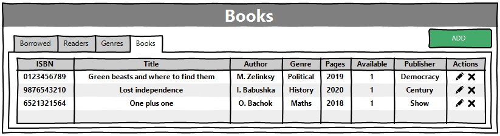
Pic 4.1 View the books list.

The list displays the following columns:

* ISBN - Book's ISBN;
* Title - title of the book;
* Author - author of the book;
* Genre - genre of the book;
* Pages - total pages count;
* Available - count of available copies;
* Publisher - publisher of the book.

### 4.2 Add book

**Main scenario:**

* User clicks the "Add" button in the books list view mode;
* Application displays form to enter book data;
* User enters book data and presses "SAVE" button;
* If any data is entered incorrectly, incorrect data message is displayed;
* If entered data is valid, then record is added to the database;
* If error occurs, then error message is displayed;
* If new book record is successfully added, then updated list of books is displayed. 

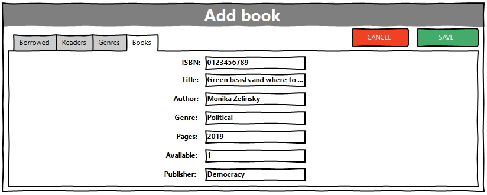
Pic. 4.2 Add book

**Cacel operation scenario:**
* User clicks the "Add" button in the books list view mode;
* Application displays form to enter book data;
* User enters book data and presses "CANCEL" button;
* List of books without changes is displayed to user.
* If the user selects tabs "Borrowed", "Readers", "Genres", or "Books", the data will not be saved in the database, and the corresponding form will be opened.  

When adding a book, the following details are entered:

* ISBN - book's unique International Standard Book Number;
* Title - book's title;
* Author - book's author full name;
* Genre - genre of the book;
* Pages - number of pages;
* Available - number of copies;
* Publisher - publisher of the book.

Constranits for data validation:

* ISBN - unique, maximum length of 13 characters;
* Title - maximum length of 45 characters;
* Author - maximum length of 45 characters;
* Genre - maximum length of 45 characters;
* Pages - maximum length of 4 characters;
* Available - maximum length of 2 characters;
* Publisher - maximum length of 45 characters;

### 4.3 Edit book

**Main scenario:**

* User clicks the "Edit" button in the books list view mode;
* Application displays form to edit book data;
* User enters book data and presses "SAVE" button;
* If any data is entered incorrectly, incorrect data message is displayed;
* If entered data is valid, then record is edited in the database;
* If error occurs, then error message is displayed;
* If a book is successfully edited, then updated list of books is displayed. 

Pic. 4.2 Edit book

**Cacel operation scenario:**
* User clicks the "Edit" button in the books list view mode;
* Application displays form to enter book data;
* User enters book data and presses "CANCEL" button;
* List of books without changes is displayed to user.
* If the user selects tabs "Borrowed", "Readers", "Genres", or "Books", the data will not be saved in the database, and the corresponding form will be opened.  

### 4.4 Remove the book

**Main Scenario:**
* User clicks the "Delete" button in the books list view mode;
* Application displays confirmation dialog “Are you sure you want to delete book?”;
* The user confirms the deletion of the book;
* Record is deleted from the database;
* If error occurs, then error message is displayed;
* If the book record is successfully deleted, then up to date list of books is displayed.

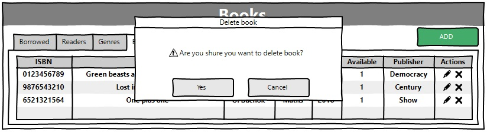
Pic. 4.4 Delete book dialog. 

**Cacel operation scenario:**

* User clicks the "Delete" button in the books list view mode;
* Application displays confirmation dialog “Please confirm delete reader?”;
* The user cancel the deletion of the book;
* List of books without changes is displayed to user.
* If the user selects tabs "Borrowed", "Readers", "Genres", or "Books", the data will not be saved in the database, and the corresponding form will be opened. 

